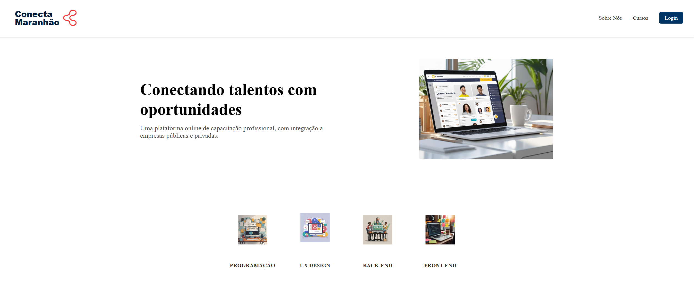
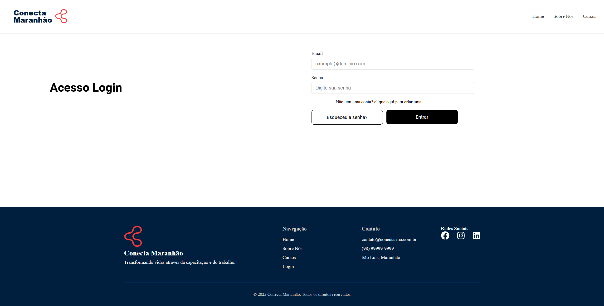
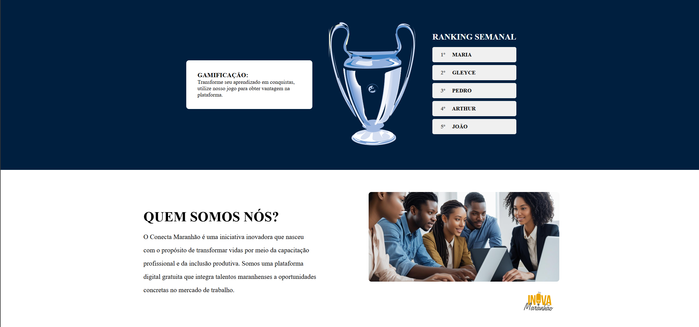
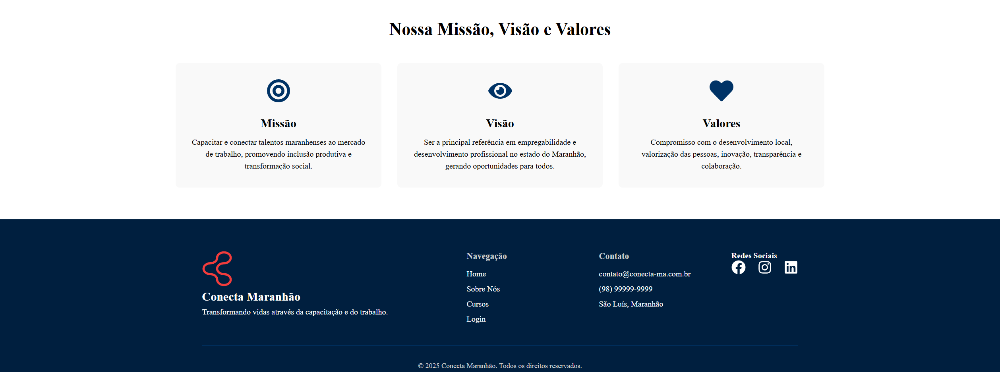

# 💻 Conecta Maranhão

<p align="center">
  
</p>
<p align="center">
  
</p>
<p align="center">
  
</p>
<p align="center">
  
</p>
---

## 📜 Descrição

O **Conecta Maranhão** é uma plataforma web inovadora, projetada para ser um elo entre talentos maranhenses e o mercado de trabalho. O projeto oferece um ambiente de capacitação profissional, gamificação e oportunidades de emprego, visando a inclusão produtiva e o desenvolvimento social no estado.

Este projeto representa a culminação do **Desafio 5 do Programa Trilhas Inova Maranhão**. Ele foi desenvolvido de forma colaborativa, integrando o trabalho das trilhas de Front-End, Back-End, Dados, Games e UX/UI para criar uma solução completa e funcional.

---

## ✨ Features

-   [✔] **Páginas Múltiplas:** Navegação fluida entre as páginas Home, Sobre e Cursos com `react-router-dom`.
-   [✔] **Layout Responsivo:** Componentes que se adaptam a diferentes tamanhos de tela (desktop e mobile).
-   [✔] **Componentização:** Estrutura organizada com componentes reutilizáveis para seções, cards e layout.
-   [✔] **Homepage Detalhada:** Apresentação completa do projeto com seções de Hero, Categorias, Ranking e Sobre.
-   [✔] **Página de Login:** Layout para autenticação dos alunos na plataforma.
-   [✔] **Página de Cadastro:** Layout para cadastro de alunos na plataforma.
---

## 💻 Tecnologias Utilizadas

Este projeto foi desenvolvido utilizando as seguintes tecnologias:

-   **Front-End:**
    -   [**React**](https://reactjs.org/)
    -   [**TypeScript**](https://www.typescriptlang.org/)
    -   [**Vite**](https://vitejs.dev/)
    -   [**CSS Modules**](https://github.com/css-modules/css-modules)
-   **Comunicação HTTP:**
    -   [**Axios**](https://axios-http.com/)
-   **Roteamento:**
    -   [**React Router DOM**](https://reactrouter.com/)
-   **Ícones:**
    -   [**React Icons**](https://react-icons.github.io/react-icons/)

---

## 🚀 Como Executar o Projeto

Siga os passos abaixo para executar o projeto em seu ambiente local.

**1. Clone o repositório:**
```bash
git clone [https://github.com/ConectaMaranhao/Front-End]
cd conecta-maranhao 
**2. Instale as dependências:**
```bash
npm install
**3. Inicie o projeto:**
```bash
npm run dev
O servidor de desenvolvimento será iniciado em http://localhost:5173 (ou outra porta, se a 5173 estiver em uso).
```
---

## 📌 Observações
*Este projeto foi desenvolvido com fins educacionais, com o objetivo de aprimorar minhas habilidades em desenvolvimento front-end. Foi uma oportunidade de colocar em prática conceitos e técnicas aprendidas, e estou aberto a feedbacks e sugestões para melhorá-lo ainda mais! Se você tiver alguma ideia ou recomendação, sinta-se à vontade para compartilhar.*

---

## 👨‍💻 Desenvolvido Por:

[Nadson Cutrim 🦆](https://github.com/Nadson-Cutrim)
[Pedro Enrique 🚀](https://github.com/PedroEnriqueLX)
[Cássio Rezende ⭐](https://github.com/Dkcassio)